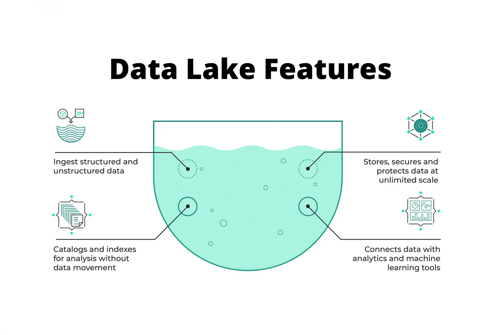
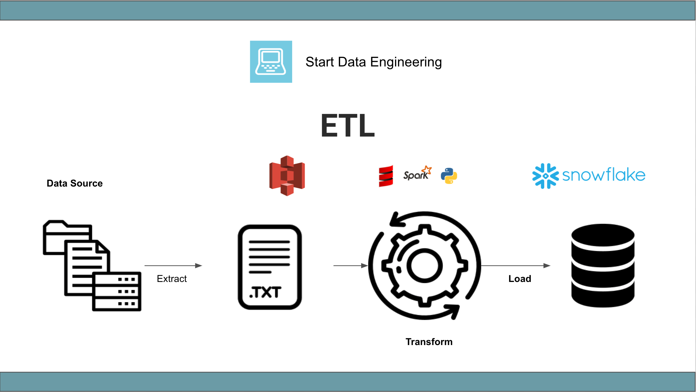
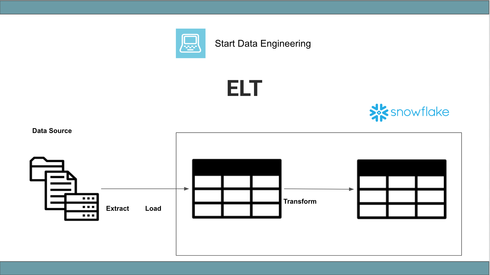

# Data Ingestion

## Data Lake
### What is Data Lakes?

***Data Lake*** is a central repository that holds big data from many sources.

The data structure in Data Lake can be **structured**, **semi-structured** or **unstructured.**

The idea is to **ingest data as quickly** as possible
and **making it available** to the other team members.

A data lake solution generally has be:
* Secure
* Scalable
* Albe to run on **inexpensive** hardware

### **Data Lake** vs **Data Warehouse**

A **Data Lake** (DL) is not to be confused with a **Data Warehouse** (DW). There are several differences:

A **data lake** is an **unstructured data**, target users are **data scientists, data analysis**. It storeds **huge amount** of data (PB) . Use cases: **stream** processing, **machine learning** and **real-time** analytics.

Data Warehouse: the data is **structured**, users are **Business Analysis**, data size is generally **small**, use cases: **batch** processing, bi reporting.

## How did it start?
* Companies realized the value of data
* Store and access data quickly
* Cannot always define structure of data
* Usefulness of data being realized later inthe project lifecycle
* Increase in data scientists
* R&D on data products
* Need for cheap storage of Big data

## ETL vs ELT
When ingesting data, DWs use the **Export**, **Transform** and **Load** (ETL) model whereas DLs use **Export**, **Load** and **Transform** (**ELT**).

* **Extract**: The process of getting the data from the source system. E.g., a python process to get data from an API, access data from an OLTP database, etc.

* **Transform**: The process of transforming the extracted data. E.g., changing field types & names, applying business logic to the data set, enriching data, etc.

* **Load**: The process of loading the transformed data into the data asset used by the end-user.

ETL is mainly used for a **small** amount of data whereas ELT is used for **large** amounts of data.

**ETL** is a **data warehouse** solution whereas **ELT** is a **data lake** solution. The idea of an ELT is schema on right that you define a well-defined schema, define the relationships and then you write the data, whre elt is based upon schema on read, where you write data first and determine the schema on the read.

## Gotcha of Data Lake 
Data Lakes are only useful if data can be easily processed from it, but soon convert into a ***data swamp*** which makes it very hard to useful by da or ds. Some of reasons that a data lake convert into data swamps is:
* No versioning
* Incompatible schemas for the same data without versioning
* No metadata associated
* Joins not possible

## Cloud provider for data lake:
Some cloud provider for Data Lake:
* GCP - [Cloud Storage](https://cloud.google.com/storage)
* AWS - [S3](https://aws.amazon.com/vi/s3/)
* Azure - [Azure Blob Storage](https://azure.microsoft.com/en-us/products/storage/blobs)

### Source:
[Whats the difference between ETL & ELT? - StartDataEngineering](https://www.startdataengineering.com/post/elt-vs-etl/#2-e-t-l-definition)

[DE Zoomcamp 2.1.1 - Data Lake - DataTalksClub](https://youtu.be/W3Zm6rjOq70?si=zfzyaJXrB_ADzya5)